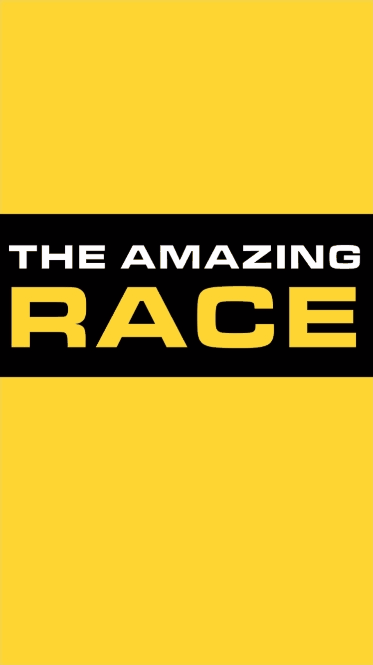

I'm typically not one to set myself resolutions, I've written or blogged about them in the past but then nothing ever came to fruition and I lost motivation after about a month. At the start of 2016 I decided to set myself one main goal which had a couple of aspects to it but being a single goal it was easy to keep focused on rather than having a whole list of resolutions. Besides even Mark Zuckerberg sets himself a single personal goal each year so it must be effective to some extent.

In 2016 my goal was to play more board games, my collection had ballooned to the point of me struggling to play many of them so I decided to try to:

- Play all of the games in my collection at least once

- Play 10 games at least 10 times

- Play 100 games at least once

Even though I didn't complete any of these goals, it at least had the effect of providing a point of focus and I think I will make a separate post on how close I came.

### My 2017 Goal

One of the things that has been a point of frustration with myself is never being able to keep focus on a single side-project to the point where I get something that I can give a user. I feel like I have only been able to do this once because I was on a hard deadline so it was difficult for me to deviate from the delivery date. I built an app that simulates The Amazing Race for my girlfriend and I to celebrate 1 year of being together.

The app was complete with 12 stages and she could only progress to the next stage when she was either at the location or a certain amount of time had elapsed. She was blown away by the whole thing, it was so awesome to see her reaction to it and that is what has inspired my personal challenge for 2017.

**In 2017 I aim to complete 6 side projects that I have previously started or conceptualised and written down.**

This is also partially inspired by [1 Project Per Month (1PPM)](http://1ppm.club/), [1 Game A Month (1GAM)](http://www.onegameamonth.com/) and the [12 startups in 12 months](https://levels.io/12-startups-12-months/) work of levels.io. Although I didn't want to commit to a one month timeline for each project because I know throughout the year things will come up that make me need to put off what I'm working on at the time. I have also made the distinction of working on projects that I have previously started since I would like to get some of them finished and my problem has never been starting projects. That is not to say I can't work on new ideas, they may be really great, its just my priority will be on the ideas that previously got me excited but then I lost focus.

One concern I have is the very real possibility of developer burnout. Juggling full time work and side project work has the possibility of causing developer burnout; it is something I have experienced and it typically strikes when you least want it to.

My definition of complete is something I can put in the hands of users and allow them to use without constant intervention from myself. I think the real challenge comes in delivering a minimal set of features that allows for people to use a product because I have been known to succumb to scope creep.

### Early Thoughts

I have gone into this with a few thoughts on what I would like to work on throughout the year. This includes:

- This website. Starting off the year I decided to go down the route of using Jekyll on Github pages with Cloudflare to deliver my website. I have developed my personal site in the past using Angular 2 or React but really a static site is all I need. I am using this great theme called beautiful-jekyll from Dean Attali.

- The Amazing Race builder and app rewrite. Initially when I developed my Amazing Race app, the race was entirely hardcoded within the app. I would like to change this so anyone can build their race through a web portal and then within the app you can enter a race ID to get access to it. I would also like to rewrite the app partially because I structured it incorrectly and by the time I realised, it was too late for me to rewrite it before the deadline date.

- At least one game. I have multiple games in progress but I have never put in the effort to complete one. I kind of want to attack these as game jams initially and then polish from there. I would really love to get a game that I have made in the hands of friends and family to see their reactions.

- Something using either the Board Game Geek API or Riot API. Ever since Riot released their API, I have always wanted to do something with it. Through my job currently, I am doing a lot of work on data visualisations in the browser so I think it would be a good way of getting more indepth knowledge. Last year I started building something with the Board Game Geek API to keep track of my personal goal but it never got completed.

The last 2 ideas I'm going to leave completely open ended for now and see what inspires me when I go to work on them.

### Tracking my Progress

Ideally I would like to do something like a "Friday Retro" post on this page with a changelog of the things I worked on for the week but I need to come up with a way of making it automatic so that I don't ignore it. An easy way would be to set a reminder to do it but I want to automate the process somewhat so I can maybe jot down notes in a branch during the week which automatically gets merged into the master branch on a Friday. I'll continue to explore this idea as I ramp up my progress.

I look forward to updating you on my progress throughout the year and I really hope that this is the start of something really productive and awesome!
