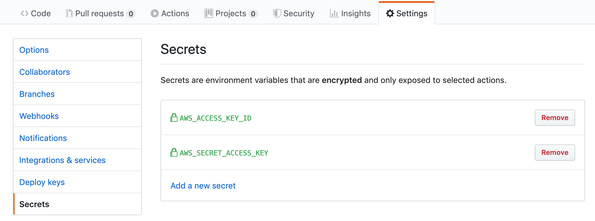

<meta property="og:image"
    content="http://timveletta.com/img/travis-ci.png" />

I was fortunate enough to get a beta invite to Github Actions earlier this week so I figured I would try it out to deploy a static website to AWS as a way of comparing with other tools such as GitLab and AWS CodeBuild.

My initial impressions of the platform was that it wasn't as intuitive as I was hoping however I can see some real advantages in how much they push creating reusable build steps to speed up creating CI/CD pipelines.

Firstly, lets look at some of the main building blocks GitHub Actions:

- **Workflow** - a workflow is the automated process that is triggered by an event, usually a pull request or push to the repository. A single repository can have multiple workflows that handle separate, generally unrelated processes. Workflows are made up of jobs.
- **Jobs** - a job is a self contained series of steps which by default run in parallel to each other. Initially I thought jobs were self contained individual pieces of work that form my build and deploy pipeline but quickly figured out that they don't share any information as far as I can see.
- **Steps** - individual pieces of work that perform a small piece of your job.

## My approach

I've gone ahead and created 2 jobs within my workflow; one to manage building a deploying and another to manage testing my code. Each of these jobs run on both push and pull request as shown by `on: [push, pull_request]`. They both start by checking out the code using the reusable action `actions/checkout@master`, setup Node.js using `actions/setup-node@v1` and then install dependencies using npm.

From here the jobs differ in that the test job just runs the tests and then is complete. The build and deploy job runs the build and will upload the artifact to GitHub, using `actions/upload-artifact@master`, before deploying to S3 and invalidating the CloudFront cache **only if we are on the master branch** (i.e. `if: github.ref == 'refs/heads/master'`)

## Keeping your secrets safe

Its as easy as going into your repository settings, going to secrets and then setting them up. You refer to them in your build job using `${{ secrets.SECRET_NAME }}`.

<center></center>

## The workflow configuration

```yaml
name: CI/CD

on: [push, pull_request]

jobs:
  run-tests:
    runs-on: ubuntu-latest
    strategy:
      matrix:
        node-version: [10.x]
    steps:
      - uses: actions/checkout@master

      - name: Setup Node.js ${{ matrix.node-version }}
        uses: actions/setup-node@v1
        with:
          node-version: ${{ matrix.node-version }}

      - name: Install Dependencies
        run: npm install

      - name: Run Tests
        run: npm test
        env:
          CI: true

  build-and-deploy:
    runs-on: ubuntu-latest
    strategy:
      matrix:
        node-version: [10.x]
    steps:
      - uses: actions/checkout@master

      - name: Setup Node.js ${{ matrix.node-version }}
        uses: actions/setup-node@v1
        with:
          node-version: ${{ matrix.node-version }}

      - name: Install Dependencies
        run: npm ci

      - name: Build Package
        run: npm run build

      - name: Upload Artifact
        uses: actions/upload-artifact@master
        with:
          name: public
          path: public

      - name: Deploy to S3
        if: github.ref == 'refs/heads/master'
        uses: actions/aws/cli@master
        with:
          args: s3 cp ./public s3://<<INSERT S3 DIRECTORY HERE>> --recursive
        env:
          AWS_ACCESS_KEY_ID: ${{ secrets.AWS_ACCESS_KEY_ID }}
          AWS_SECRET_ACCESS_KEY: ${{ secrets.AWS_SECRET_ACCESS_KEY }}

      - name: Invalidate Cloudfront CDN
        if: github.ref == 'refs/heads/master'
        uses: actions/aws/cli@master
        with:
          args: cloudfront create-invalidation --distribution-id=$CLOUDFRONT_DISTRIBUTION_ID --paths '/*'
        env:
          AWS_ACCESS_KEY_ID: ${{ secrets.AWS_ACCESS_KEY_ID }}
          AWS_SECRET_ACCESS_KEY: ${{ secrets.AWS_SECRET_ACCESS_KEY }}
          CLOUDFRONT_DISTRIBUTION_ID: <<INSERT DISTRIBUTION ID HERE>>
```

You can view the [syntax for creating workflows here](https://help.github.com/en/articles/workflow-syntax-for-github-actions).

The code I have included is current as of the 31st of August 2019 but could change in future. I'll be sure to [include the updates here](https://gist.github.com/timveletta/6242924449509876f7658dca0052d402).
