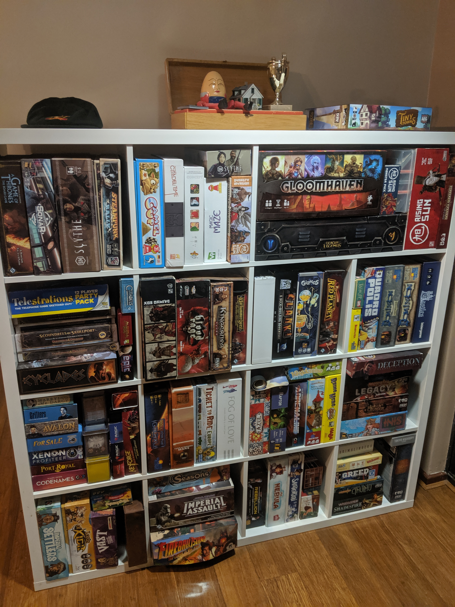
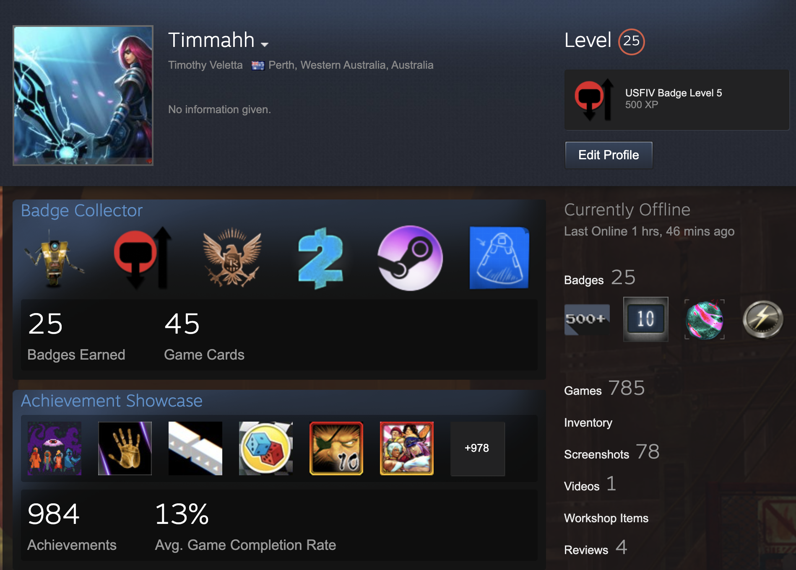

In my [previous post](https://timveletta.com/going-deep-in-2020-part-1/), I went a little bit into _what_ it meant to be **"Going deep in 2020"**; in this post, I'll look into the _why_ and the _how_.

My main hobby is board games, I love collecting them, researching them and perhaps most importantly playing them. I have been involved in the hobby for the last 6 years, collecting games and immersing myself in the community as much as possible. I dedicate time and effort into going to meetups, hosting my own and trying to introduce as many people to what I think is a brilliant way to spend time in the day and age.

However, board gaming as a hobby is also one of excess. You'll often hear terms such as _"cult of the new"_ and _"acquisition disorder"_ thrown around in community forums where _comment on my collection_ (COMC) posts become virtual dick-measuring contests.

I'm no better at any of this, I find it difficult to fight the impulse when I hear about a new game which fills a supposed _hole_ in my collection. In the past couple of years, I've managed to become more realistic about what games I will _actually_ play given my regular board gaming groups and adjusted my buying habits accordingly however I still haven't played 11 of the games in my collection.

I have all these board games that I enjoy, but there is 101 of them in total; the trouble is I don't have enough time to **go deep** into each one of them. Most games I take off the shelf once a year, relearn the rules, play it once only to understand the strategy on a surface level before it collects dust for another year.

**This year it stops, this year I'll go deeper into the games I have, this year I won't succumb to the _"cult of the new"_.**

This boils down to 2 main objectives:

1. No more acquiring board games as long as I have unplayed board games in my collection.
2. If a new board game is completely necessary then it **must** replace an existing game in my collection.

---

Although I've mostly looked at board games in this post; it doesn't make sense to just apply it to them when my other hobbies are just as prone to the same issues.

One look at my Steam account will highlight this issue manifesting through video games and my Github account is mostly a collection of prototypes that have been started but fallen away for one reason or another.

This gives rise to a further 3 objectives:

4. No more buying video games, full stop.
5. Finish at least 12 video games this year.
6. No more new side projects until I finish or close off all of my existing side projects.

I'm hoping to keep myself accountable to this by making monthly posts about how I'm **going deeper** in 2020 so I look forward to telling you about my journey.
