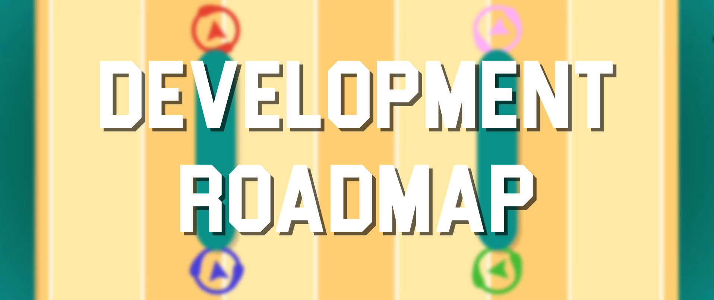
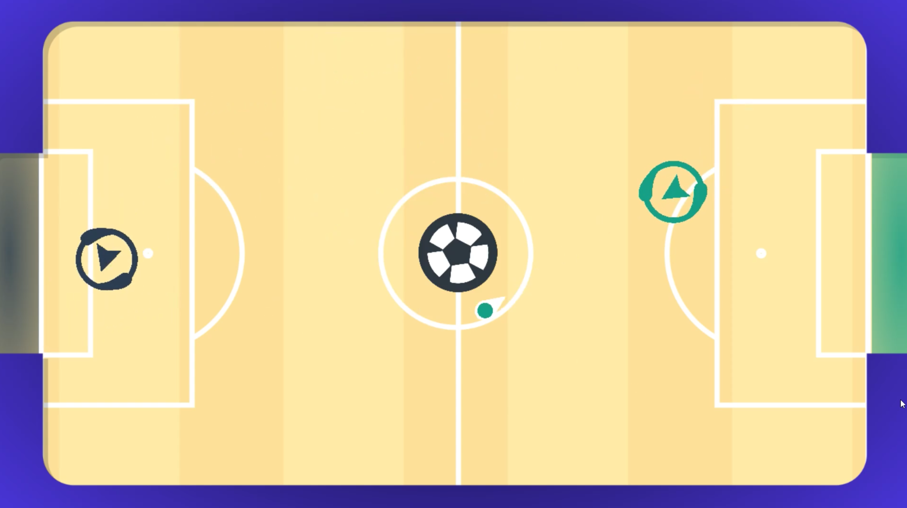
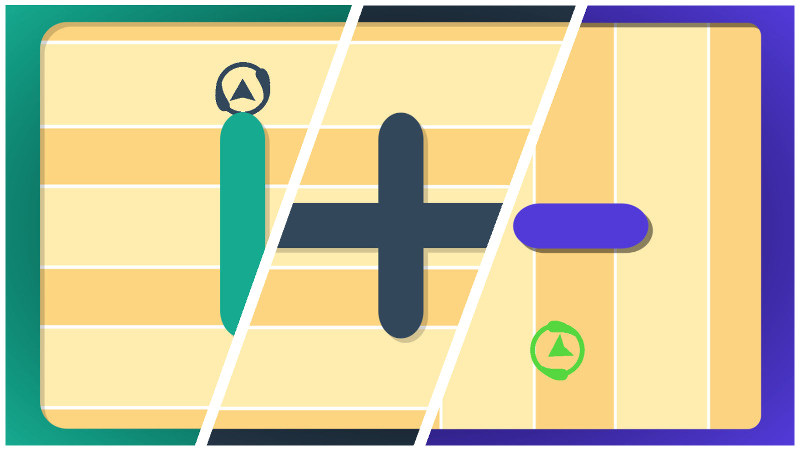

    

To coincide with Major League TeleBlast going into beta this week I have put together a rough development roadmap going forward to give you some insight into my plans for the game. As part of the beta, **I have released the game for purchase on itch.io for \$4.99 which is a 50% discount on what the game will be upon final release. Anyone who purchases the game during this phase will also be given a Steam key upon release.**

The platforms I am looking to publish to include **Windows**, **Mac** and **Linux** through Steam, **Xbox** and **WiiU** because I own one and my target audience, like myself, have probably bought 4 controllers for Smash Bros already. I would also like to publish to **Playstation** and **Nintendo Switch** however their indie game publishing process is a bit more involved than that of Steam or Xbox.

Here is a list of features I am looking at implementing:

## Teams

The only game mode Major League TeleBlast currently supports is a free-for-all round-by-round fight to see who can blow up the most players however going forward I would like to implement more team oriented modes that are generally 2v2. I would have to implement some sort of menu system for selecting teams and a way of being able to distinguish players individually and by what team they belong to. More on that below.

## Modifiers

One of the things I love the most about games such as Towerfall is that it is a simple mechanic that can be presented in a couple of different ways to keep things fresh and interesting. Thats what I would like to do with Major League TeleBlast; have a simple core mechanic that can be played in a couple of different ways. Some of the modifiers I would like to implement include:

- Gradually slow down player movement speed once they have shot their teleporter.
- The only way to move is by teleporting.
- Limited teleporters that get dropped in the position where a player teleported from and any player can pick them up to teleport again.
- You have to charge your teleporters before firing them with the longer you charge, the faster they move.
- Instead of an explosion, teleporting causes a circle of projectiles to fire out from the position the player teleported to.

I am always open to new ideas around modifiers for the game and I'm hoping further playtesting will give rise to additional game modifiers.

## Additional Game Modes

### Capture the Flag

Can be played as either a free-for-all or teams game. There will be a single flag that players have to return to their base however they cannot teleport while holding the flag.

### King of the Hill

Will only be available as a free-for-all mode where the "hill" moves around the arena and the players currently in it score ongoing points. I imagine this will be a bit interesting due to the explosive nature of the game that can cover large areas of the arena.

### Football

    

I have gone through and put together a proof of concept for this game mode which can be [found here](https://www.timveletta.com/2018/06/19/major-league-teleblast-football-demo.html). Two teams will go at it in an effort to score the most goals within a certain time limit.

### Paint the Arena

Inspired in part by Splatoon, the idea is that explosions will paint the arena in that players color and they will be able to move quickly in through that area. The game is won by the player who has painted the largest area. This might have to be a trial mode since I'm not sure of how well it will play out.

## Additional Maps and Backgrounds

    

I'm looking to have in-excess of 10 maps to play on at launch with around that many different backgrounds to select from. It would also be a good thing to have a randomise button for those who don't want to make a choice.

## Improvements to Game Feel

Right now I feel like the game is missing something around player feedback; it just feels like some actions have no significant feeling to them. For instance, explosions just don't feel 100% satisfying. Some effects I am going to trial to improve game feel include:

- Camera shake on explosions - this is something I tried previously but had a poor implementation of it and the feedback was generally negative.
- SlowMo when a player is blown up - would add more impact to those moments. I think it would also be improved if I slowed down the music during those moments also.
- Better sound effects since they seem really hollow. More bass!
- Improved explosion graphics which make them feared, right now its a circle (of death)
- Player and explosion trails to give a greater feeling of movement and fluidity.

## More Crisp Graphics

Currently my issue is that some of the graphics seem very pixel-ly when rotating them which decreases the overall quality of the game. I would like to make them pixel perfect and more crisp especially at high resolutions.

## Better Sound Effects and Music

This relates back to game feel but right now most of the sound effects are those I made in SFXR during the game jam and they have a really hollow feeling to them. I really want to improve them to evoke more feeling and impact in the player actions.

## Guidance for New Players

Currently the game has no guidance for those that are new to the game, they just get thrown into arena and could end up blown up 2 seconds later without really understanding what they can and can't do. So yeah, something to help with that.

## Key Rebinding

When I was building my arcade machine; games with rebindable controls were highly favorable and so I started to implement that within my game however it was perhaps a bit early for me to do that. I currently have a screen and some functionality to rebind keys however it hasn't been tested thoroughly.

## Game Analytics

I've recently done some work for another project to collect data from a Unity game and send it to AWS. I would like to replicate some of this work to collect player data and put together some interesting statistics such as hotspots of where people get blown up. It will however be interesting to do that in a way that players feel comfortable given all the privacy concerns around the work right now.

I am currently in the process of assessing all of these tasks and trying to put together a timeline of when I would like to have them done. Once I come up with that, I'll put together a post detailing it further. If you have any suggestions or ideas, feel free to get in contact with me through social media or my Discord channel.
