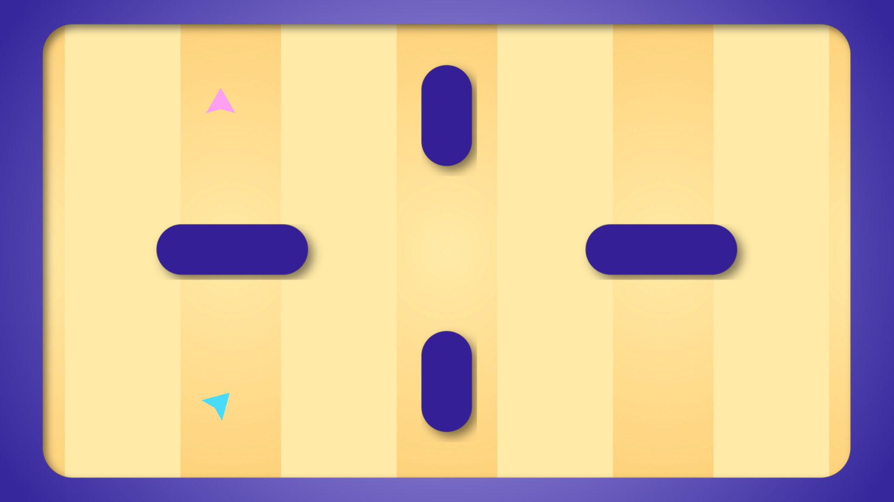
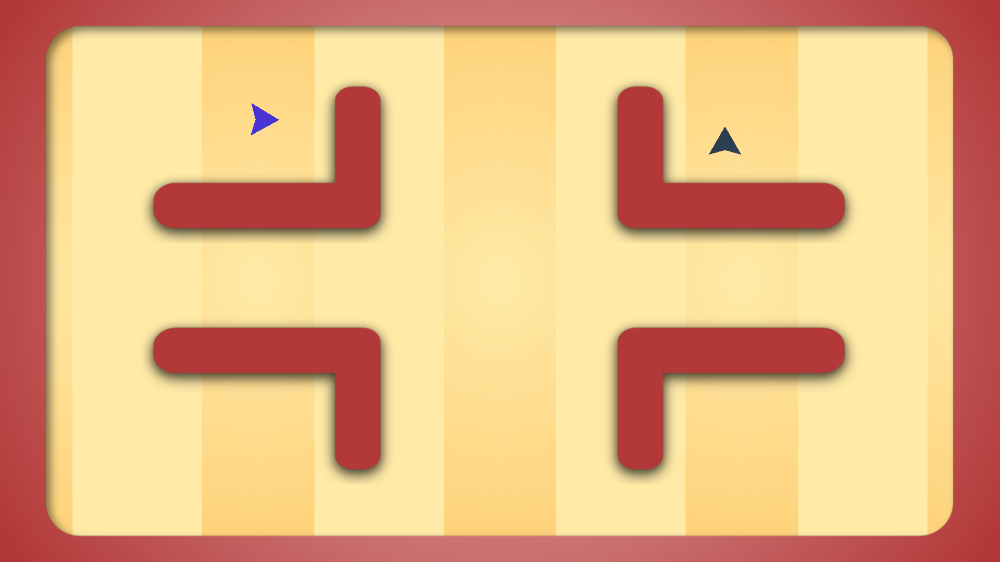
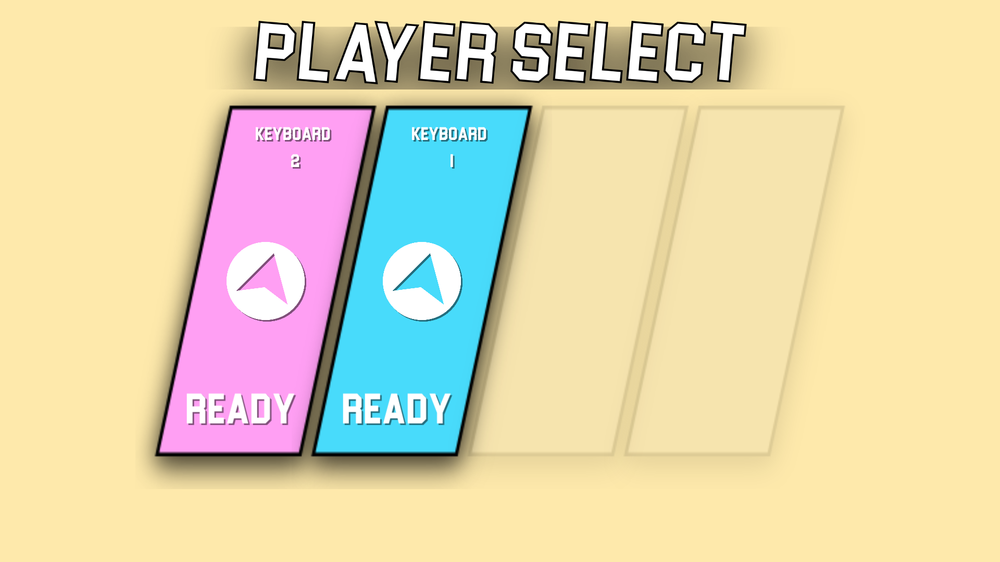
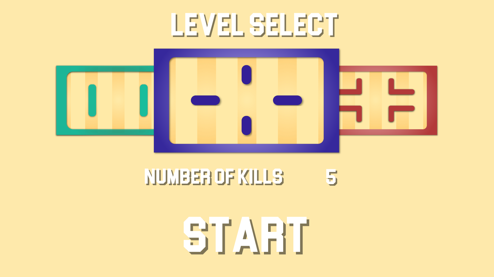

Following on from Global Game Jam and in preparation for the After the Jam event, I have made a series of changes and updates to Major League TeleBlast; in this post, I will detail the changes made.

# Gameplay Changes

## General

- **Added** delay at the start of rounds in which players can rotate but not move or shoot. This is to prevent the fire-and-hope at the start of rounds to get kills.

## Player

- **Increased** player move speed from 10 to 15

## Explosion

- **Decreased** explosion expansion speed from 5 to 4
- Player explosion stops expanding if they get killed while exploding. i.e. if you teleport into another players explosion

## Teleporter

- **Added** minimum teleporter speed which enables it to keep going even if it hits another player/teleporter or generally slowing down because of friction.
- **Fixed bug** where teleporters would remain in play if the round ended with another 2 players killing each other.

# General

## Controls

- **Added** ability for 2 players to play on keyboard
- **Added** back button control for all controllers, this corresponds to B on an Xbox controller and ESC/Backspace on keyboard.

## Levels

- **Modified** spawns on the original level so that players only have direct line of sight on the player horizontally opposite them when the round starts.
- **Added** the plus (+) level where players only have line of sight of the player diagonally across from them when the round starts.
  

      
  

- **Added** the L's level when no one has direct line of sight on each other when the round starts.
  

      
  

## Screens

- **Removed** the player selects from the main menu, replaced them with Play and Quit buttons.
- **Added** player select screen which now allows players to choose their colours.
  

      
  

- **Added** level select screen where players can choose which of the 3 levels they would like to play and how many kills they are playing to.
  

      
  

- **Fixed bug** where the round end screen didn't show the correct number of kills for each player.

# Tried But Removed

- A 0.3 second slow motion effect when someone gets hit by an explosion was meant to add dramatic effect to the action but it just looked as though the game was lagging.
- A 'dotted line' trail effect was added to teleporters to allow players to see how far they had travelled and therefore how big the explosion could be but instead it just cluttered up the screen.
- A screen shake effect was added whenever a player caused an explosion which was meant to add dramatic effect but again made the game feel like it was lagging.
- When the player shot out their teleporter, their movement speed was reduced based on how far their teleporter had moved. This became frustrating for players and didn't have any visual clues which increased the complexity of the game.

From here I am going to take a couple of weeks off development since it is a pretty busy time trying to organise birthdays and I feel like I will get burnt out if I continue to push myself. Also don't forget to check out [www.teleblastgame.com](www.teleblastgame.com) and get the latest build!
