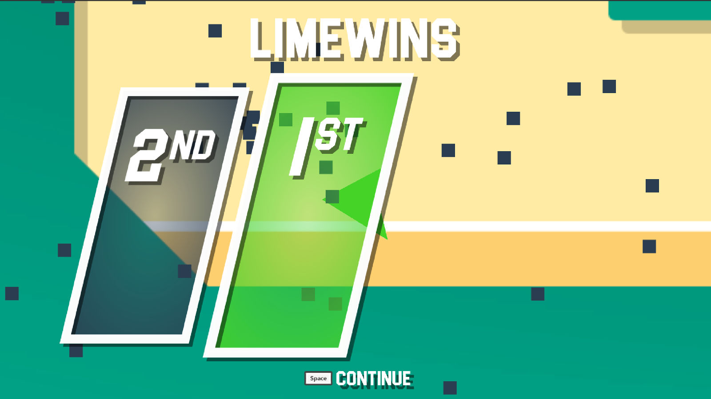

Lately I have been finding more time to work on Major League TeleBlast to prepare for beta and eventually submit to showcase at the PAX Australia indie booth. As a result I have had to get more organised around my task list in order to determine which features need to be completed for beta.

# User Interface

The first thing you will notice is that a lot of the UI elements have been changed since 0.2. I have done some extensive work around the design of each of the menus and in-game screens but rather than talking about them here are the screenshots.

    <figure>
        
        <figcaption>Main Menu</figcaption>
    </figure>

    <figure>
        
        <figcaption>Player Select</figcaption>
    </figure>

    <figure>
        
        <figcaption>Game Select</figcaption>
    </figure>

    <figure>
        
        <figcaption>Level Select</figcaption>
    </figure>

    <figure>
        
        <figcaption>Round End</figcaption>
    </figure>

    <figure>
        
        <figcaption>Game End</figcaption>
    </figure>

## General

- **Added** options screens to allow users to change screen resolution and music/sound effects volume
- **Added** pause screen for all your in-game timeout needs.

    <figure>
        
        <figcaption>Options</figcaption>
    </figure>

    <figure>
        
        <figcaption>Pause</figcaption>
    </figure>

# Gameplay Changes

## General

- **Added** shields which saves the player from being hit once. When the player is hit while their shield is up, they are pushed away based on the magnitude of the explosion. Each player starts the game with a shield and each round thereafter, shields are granted based on the number of kills each player has as a form of catch-up mechanic.
- **Added** the dash ability. Have you ever misfired your teleporter and found yourself with no way to escape? Well the dash ability is for you! The dash ability can be used by pressing either left or right trigger (left shift on keyboard) and has a short cooldown to keep you flying like a butterfly.
- **Added** controller vibration when the player teleports, their shield is popped or they get blown up by another player.

    <figure>
        
        <figcaption>Shield Knockback</figcaption>
    </figure>

## Levels

- **Modified** each of the 3 levels with the following changes:
  - Fixing some of the collision boxes around the corners to make the collisions more predictable.
  - Removing SVG shadows and using Unity inbuilt shadows instead to give me more control within the editor.
  - Allow for the color of the walls to be changed.

    

    

    

- **Added** more level backgrounds for additional customisation.

This week continues the push towards beta which means fixing some remaining issues and working on my marketing strategy. I am currently working on creating a page on itch.io for the game and from beta onwards, the game will be purchaseable through that page. You can view the upcoming features that are on [my roadmap here](https://trello.com/b/lBUvr9aF) and I have setup a Discord channel to gather feedback and talk to people so please feel free to [join it here](https://discord.gg/4SHJHvb).

You can download version 0.3 of Major League TeleBlast below.

    <a href="https://s3-ap-southeast-2.amazonaws.com/majorleagueteleblast.com/MajorLeagueTeleBlast-0.3-Windows.zip">
        <svg style="width: 64px; height: 64px;" xmlns="http://www.w3.org/2000/svg" viewBox="0 0 88 88"><path d="m0 12.402 35.687-4.8602.0156 34.423-35.67.20313zm35.67 33.529.0277 34.453-35.67-4.9041-.002-29.78zm4.3261-39.025 47.318-6.906v41.527l-47.318.37565zm47.329 39.349-.0111 41.34-47.318-6.6784-.0663-34.739z" fill="#00adef"/></svg>    
    </a>
    <a href="https://s3-ap-southeast-2.amazonaws.com/majorleagueteleblast.com/MajorLeagueTeleBlast-0.3-Mac.zip">
        <svg style="width: 64px; height: 64px;" xmlns="http://www.w3.org/2000/svg" viewBox="0 0 170 170" version="1.1"><path d="m150.37 130.25c-2.45 5.66-5.35 10.87-8.71 15.66-4.58 6.53-8.33 11.05-11.22 13.56-4.48 4.12-9.28 6.23-14.42 6.35-3.69 0-8.14-1.05-13.32-3.18-5.197-2.12-9.973-3.17-14.34-3.17-4.58 0-9.492 1.05-14.746 3.17-5.262 2.13-9.501 3.24-12.742 3.35-4.929 0.21-9.842-1.96-14.746-6.52-3.13-2.73-7.045-7.41-11.735-14.04-5.032-7.08-9.169-15.29-12.41-24.65-3.471-10.11-5.211-19.9-5.211-29.378 0-10.857 2.346-20.221 7.045-28.068 3.693-6.303 8.606-11.275 14.755-14.925s12.793-5.51 19.948-5.629c3.915 0 9.049 1.211 15.429 3.591 6.362 2.388 10.447 3.599 12.238 3.599 1.339 0 5.877-1.416 13.57-4.239 7.275-2.618 13.415-3.702 18.445-3.275 13.63 1.1 23.87 6.473 30.68 16.153-12.19 7.386-18.22 17.731-18.1 31.002 0.11 10.337 3.86 18.939 11.23 25.769 3.34 3.17 7.07 5.62 11.22 7.36-0.9 2.61-1.85 5.11-2.86 7.51zm-31.26-123.01c0 8.1021-2.96 15.667-8.86 22.669-7.12 8.324-15.732 13.134-25.071 12.375-0.119-0.972-0.188-1.995-0.188-3.07 0-7.778 3.386-16.102 9.399-22.908 3.002-3.446 6.82-6.3113 11.45-8.597 4.62-2.2516 8.99-3.4968 13.1-3.71 0.12 1.0831 0.17 2.1663 0.17 3.2409z"/></svg>
    </a>

