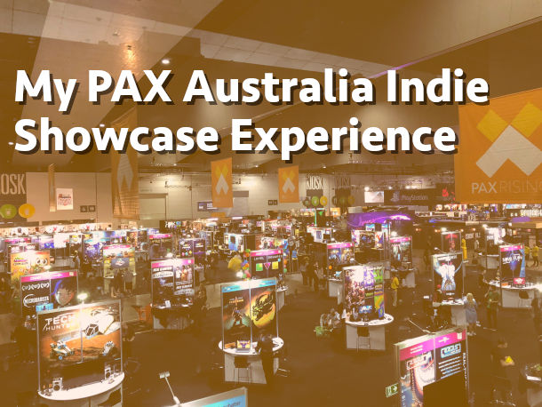
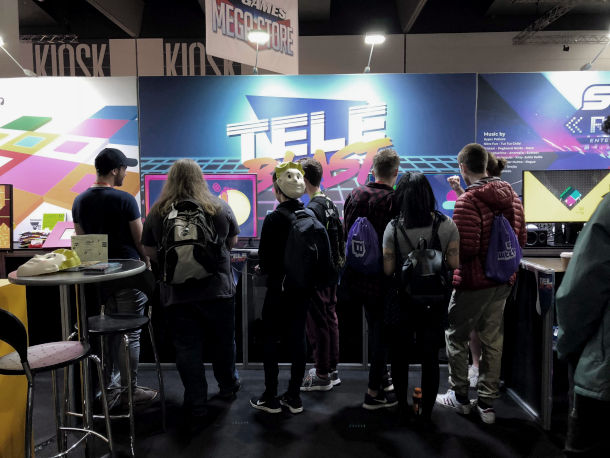
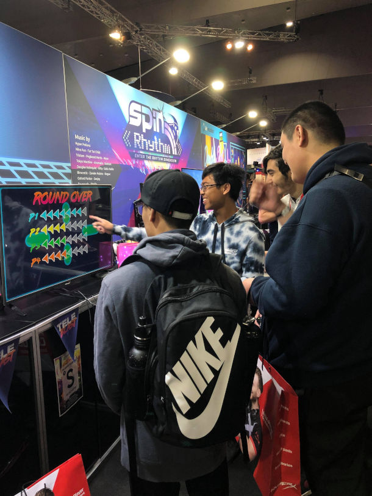
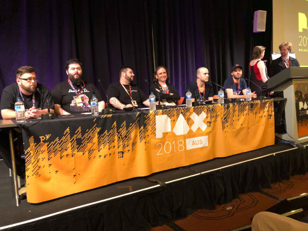
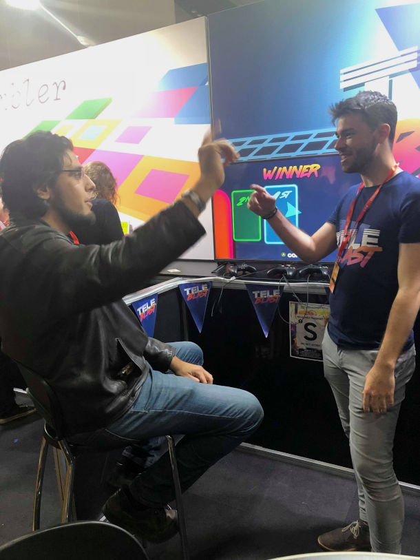
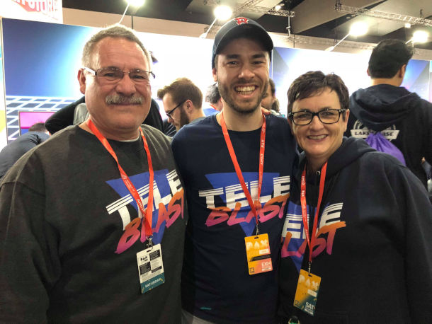
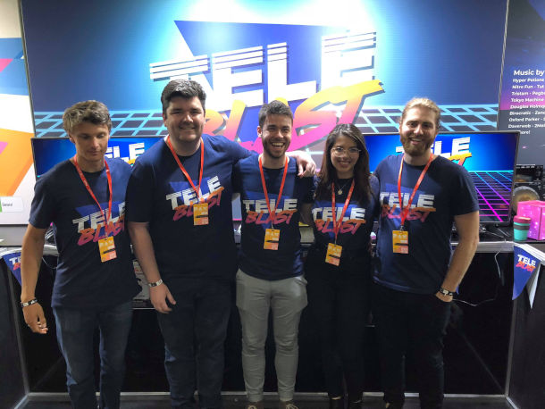

> This past weekend myself along with a small army of friends and playtesters showcased TeleBlast as part of the PAX Australia Indie Showcase. It was an absolutely unreal experience not only to have people play the game but also enjoy it enough to bring back their friends and play it over and over again. For context, TeleBlast is a local multiplayer game where up to 4 of your friends attempt to blow each other up using explosive teleporters. It started out as a Global Game Jam game and has somehow made its way to become PAX Australia Indie Showcase worthy within the space of 10 months.

  <figure>
    
  </figure>

# The Lead Up

In the lead up to PAX I tried to make sure I was completely confident in the features that were in the game and pulled out anything I had any doubts about, the last thing I wanted was for things to go wrong during the game and for people to have a bad experience because of that. We arrived a day prior to 'move in' day which allowed me to run one final playtest and fix any minor bugs that came up and after that point, I had complete confidence in the product we were about to showcase which allowed me to get some sleep that night.

# Move In Day

The day before PAX I had planned to go and pick up a television I had hired to showcase the game then make our way to the convention centre. All was going well until we arrived at the venue and found that there was 2 TVs already set up in the booth which I wasn't informed of. Initially, I had only considered running a single demo at any one time hence I had only brought 4 controllers and a single powerboard; luckily I had brought 2 laptops, one to allow me to fix any major bugs while we used the other one for the game. We ended up having to demo off both laptops which gave us some flexibility ~~if~~ when any issues arose.

  <figure>
    
  </figure>

We ended up going and buying more controllers, cables and powerboards to allow us to run the two screens and returned the spare TV that day so we didn't have to worry about it after PAX.

Move in day was also when I met Chris who owns Salty Studios and is a friend of a friend. Having been through PAX and knowing that this was my first big showcase he was able to give me all the support and advice I needed to remain calm and succeed. **Meeting him was one of the greatest parts of my PAX experience**; seeing the lengths that people would go to just to help each other out because at the end of the day, sharing is the only way the indie game development scene is going to grow particularly within Australia.

# Opening Day

So my original plan was to press the button to release TeleBlast into Early Access the morning of PAX as the doors opened at 10am however due to a mix of nervousness and excitement I couldn't sleep Thursday night and ended up releasing at around 2:30am. I slept soundly until my alarm went out however it was a mad panic from there because the game was available and people were going to play it that day. Another issue arose upon arriving at the venue. The controllers weren't working with one of the laptops because conventions are a terrible place to use Bluetooth connected controllers, there is simply too much interference. **So for the first hour of PAX we only ran with a single demo machine and a highly stressed out developer.** Luckily I had the support of my amazing demo team including my lovely partner who was able to run around doing what she could to get things working properly.

Once the doors opened, people came streaming in however they just kept walking, they didn't want to see any of these indie games or at least thats what I thought. Turns out people just wanted to make sure they got in line to see the big AAA games and would filter back towards the Indie Rising area later on. Once we started getting our first groups of players I was able to relax a bit more and get in the groove of pitching to people and getting them excited about playing the game. Since there isn't always going to be a game going on to show people and bring them in, our one sentence pitch became very important. Our pitch was

> "A local multiplayer game where you blow up your friends with teleporters"

which was simple enough to tell people what it was about and intriguing enough for them to want to know more.

  <figure>
    
    <figcaption>Our first group of players.</figcaption>
  </figure>

The first day of PAX was very much about learning how to best manage the booth, draw people in and then giving them the best experience possible. Some of the things we were able to learn and adjust during the weekend includes:

- **Only needing 3 people to run the booth at any one time.** This gave us the flexibility to have 2 people demonstrating the actual game while we had one person trying to draw people in. Also because it was a local multiplayer game, it gave us the ability to join a game and showcase where it really shines which is at 4 players.
- **How to best showcase the game.** We would jump into the basic TeleBlast game mode since the pace of the game is largely dictated by the people playing and it was a simple introduction to the mechanics of the game. It was delightful to see that 'ah-ha' moment that people would have after a couple of rounds seeing them understand the game and then become highly competitive.
  After the first game we would set them up with the Capture the Flag mode with a few gameplay variations turned on, namely 'Black Hole Explosions', which draw other players in, and 'Phase Dash', which allows players to dash through walls. We chose these options because it allowed people to experience how alternate game modes and variations would change the game in the future and it left them wanting to play and explore more.

# The Weekend

Saturday was by far the busiest day of the convention and it went by in a blur. We learnt from Friday and had a rotating roster of 3 people working on the booth which allowed each of us to have some time off to take in the rest of the show or just get some rest in the indie room. By that point we had already understood how to pitch the game and also demo it so it simply became about attracting people to the booth which was easy with a constant stream of players. One of the highlights of the weekend was a kid who played the game for around 6 of the 8 hours on the Saturday; he took on all challengers and won a lot of games but what amazed me was his enthusiasm to go home and show the game to all his friends.

  <figure>
    
    <figcaption>The Indie Showcase panel.</figcaption>
  </figure>

Saturday night was the PAX Indie Showcase panel where each of the 6 games were played on stage while we got questions from the crowd. It was mostly about how the games came about and our experience developing them. The disappointing part of the panel was how poorly the time was managed however it was something outside of my control so I didn't have too much time to dwell on it.

Sunday was a much more relaxing day, the crowds were a bit smaller and our team was well experienced with exhibiting the game. We decided to go with 2 people on the booth at any one time to allow everyone to go and see the rest of PAX. I mostly stuck around in the PAX Rising area and was able to play some of the games I was looking forward to checking out all weekend. Some of my favorites included:

- [Lanterns](http://www.artefactassembly.com/Lanterns.html) by Artefact Assembly - a charming co-operative puzzle platformer where you use light to guide your way.

- [Where the Snow Settles](https://wherethesnowsettles.com/) by Myriad Games Studio - a narrative driven adventure game where you uncover a world beyond our own.

- [Scouts Honor](https://www.scoutshonorgame.com/) by INCA Studios - a frantic couch co-op where you build scout camps across a large range of maps.

- [Lawsons Shadow](http://www.saltystudiosaus.com/dev-blog/2018/10/13/introducing-lawsons-shadow) by Salty Studios - a 90s noir inspired stealth game which evokes a realistic breaking and entering feel.

# The Indie Community

One glaring mistake that I have made during the development of TeleBlast became very apparent on the Friday night of PAX. Up until this point the game has been developed very much in isolation from the indie game development community particularly in my home city of Perth, Australia.

On the Friday night there was an event called Interface which was an opportunity for everyone in the PAX Rising area to network with each other and also with people from industry. This was my first real indie community networking event and I was quite anxious to just go up and start a conversation with someone. I was lucky enough to catch up with someone I had met before in Perth who was nice enough to introduce me to some of the other people he had met at PAX.

  <figure>
    
    <figcaption>It was amazing to have Rami Ismail come by and play the game. He gave me a ton of feedback and was just an awesome person to talk to.</figcaption>
  </figure>

**That was the first time I really understood what it meant to be "indie". It wasn't about developing games in small teams with limited funding, its about learning from and sharing with people who want to push the boundaries of what games as a medium can be.** It was amazing to talk to people who have been building games for many years about their experiences and what they had learnt. Hearing about why these people make games and what they wanted to achieve from it was awesome and in just a few short days we were able to forge connections that I'm sure will continue well into the future.

# Moment of the Convention

Some of my favorite moments of the convention included having Rami Ismail, cofounder of Vlambeer, and Jerry Holkins, cofounder of Penny Arcade, come play the game however none of these moments compare to having my parents come and experience PAX. Growing up, both of my siblings were known for their sporting prowess and despite trying a large range of sports I really wanted to just stay home and play or make games. Up until this point, my parents never really understood the impact games can have on people or that a gaming convention could be this big. When they told me that they were coming to PAX I almost broke down.

  <figure>
    
    <figcaption>My parents came decked out in TeleBlast gear.</figcaption>
  </figure>

I'm really glad that I was able to get them a ticket for Saturday so they could view the game I had made connecting people in a way that they had never seen before. They were able to see how people of all ages were able to come and share this experience, yell at each other and leave with a smile on their face.

I am so thankful that I have parents that have not only given me an amazing life but are also willing to come and support me even if they don't understand it fully. There were a couple of developers who I talked to throughout the weekend who remarked that it was amazing that my parents wanted to come to PAX because for some of them; their parents weren't willing to accept that you can make a living off developing games and that it was a waste of time. Although the industry has a way to go within Australia, PAX certainly proved that it isn't just a waste of time.

# Learnings

Some of the biggest things I learned from being a part of the Indie Showcase and PAX in general included:

- **PAX sneaks up on you and before you know it you will run out of time** to get flyers, business cards and other important merchandise printed. I had wanted to get some controller skins delivered in time for PAX however I ordered them too late and they didn't arrive in time.

- **Things will go wrong as things evidently did on the first day.** Have a plan in place for when these things do happen and chances are you will have the first hour of the Friday to iron out any last minute issues as people jump in line for the big AAA releases. Also, **people want to play your game**, if you have any issues and need to restart the game for any reason they are more than happy to relax for a minute or two amongst the frantic pace of PAX.

- **Don't be afraid to go out and pitch your game to people.** If you can show people that you really believe in the idea and come across as genuine and enthusiastic, they are more than willing to come give something a try.

- **PAX can be overwhelming and it is very important to take care of your mental and physical wellbeing**. Having people around you to take the pressure off running the booth for a couple of hours is a blessing but don't push yourself to see all of PAX in that time. There are plenty of places for exhibitors to just relax and zone out because sometimes we all need that. Trying to push yourself to always be in or around the booth is very crunchy and as we all know from Rockstar, **crunch == bad**.

# Thanks

My journey would not have been possible without the amazing support and hard work of my friends who came to help me showcase the game. They have all been part of the process from day 1 at Global Game Jam and have encouraged me to continue working on TeleBlast. I must thank my amazing partner Sitara who's love and support has allowed me to put myself out there and be the best person I can be. Charlie and Scott for help setting up the booth and taking time out from work to come and Perry who, upon finding out we got 5 tickets instead of 4, booked time off work and flights to be there at PAX just under 24 hours later.

**Finally I would like to thank everyone that came and played TeleBlast, your laughs, screams, competitiveness and enjoyment is why I will continue to make games. I make these experiences so I can share with my friends, I just hope you find them worthy of showing your friends too.**

  <figure>
    
    <figcaption>The amazing people that made showcasing TeleBlast possible.</figcaption>
  </figure>

