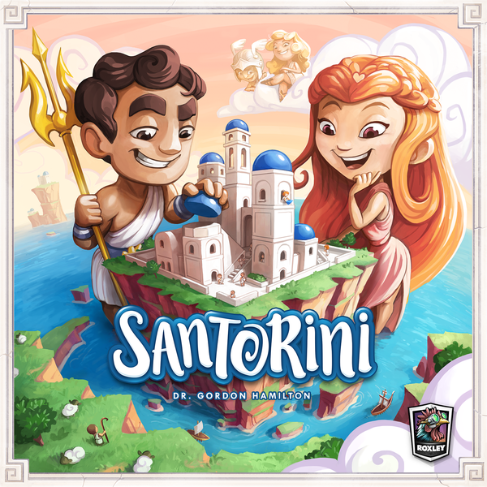

# 10. Sherlock Holmes Consulting Detective - Thames Murder and Other Mysteries

> **Not Rated Last Year; Designed by Raymond Edwards, Suzanne Goldberg, Gary Grady; Published by Space Cowboys**

    

If there is ever a game to make you feel like a detective this is it; everything about it oozes theme and takes you back to 1880s London. I love just pouring through pages of possible clues, maps and newspapers in search for possible leads and each case we have played so far has felt challenging but not frustrating. My only gripe with this game is the scoring versus Sherlock; it often feels unfair and ruins the experience at the end of the case.

# 9. Gloomhaven

> **#6 Last Year; Designed by Isaac Childress; Published by Cephlofair Games**

    

Well considering the game was delivered 2 weeks before I did the list last year, I couldn't justify putting it in my top 5 back then but I did expect it to be one of my top games this year. The reality of it is the game takes forever to set up, teach and play that I have come to the realisation that I may never get to experience a significant portion of it.

Having said that, when I do get to play it and get into a bit of a groove, this game is a fantastic, puzzling, edge of my seat brain burner which I could play for days and thats why its still in my top 10 games.

# 8. Seasons

> **Not Rated Last Year; Designed by Régis Bonnessée; Published by Libellud**

    

One of the greatest feelings in games for me is being able to build upon a combo throughout the game to unlesh on all the other players and score a ton of points. Seasons certainly gives that satisfaction through the combinations and synergies between a lot of the cards and how you can manage your resources. I also like how there is a highly visible way for players to influence the pace of the game and there is just the right amount of luck involved which can also be mitigated.

# 7. Kingsburg

> **Not Rated Last Year; Designed by Andrea Chiarvesio, Luca Iennaco; Published by Giochi Uniti**

    

Yet another game with just enough luck involved which can be mitigated. In short, I love the dice placement mechanism and how building up your village feels like building up a village in Age of Empires 2. Its quite a thinky game where you have to keep adapting your movements based on your dice results and the actions of the other players.

# 6. Clank! A Deck Building Adventure

> **#2 Last Year; Designed by Paul Dennen; Published by Renegade Game Studios**

    

Clank! has more suffered this year from a bit of deck-builder fatigue in both the industry and within my gaming group. Having said that, this is my favorite deck-building game by far and it is only improved by additional maps and cards.

I love that you have to keep an eye on what other players are doing while also having that element of push your luck to see how deep into the dungeon you can go.

# 5. Santorini

> **Not Rated Last Year; Designed by Dr. Gordon Hamilton; Published by Roxley Games**

    

I initially held off Kickstarting Santorini because I didn't want to give into the hype and it was around the time when I was trying to cut down on the number of games I backed. It is just so good as a 2 player game and the chunky pieces and thematic board just add so much to the experience. I love having to balance between managing your position on the board along with the player powers in the game and although there are some unbalanced matchups it is so entertaining.

# 4. Chinatown

> **#10 Last Year; Designed by Karsten Hartwig; Published by Z-Man Games**

    

This is the purest negotiation game that I have played; although some people could argue that luck may play too big of a part, there is nothing more satisfying than being able to negotiate yourself out of a tough spot. This game is #4 purely because every time it gets played there are some wild multi way deals being thrown around which also tend to involve anything from personal vendettas to household tasks.

# 3. Camel Up

> **Not Rated Last Year; Designed by Steffen Bogen; Published by Eggertspiele**

    

It is Camel Up, not Camel Cup and the second edition cover confirms that. Its a relatively light game that never fails to bring the tension in terms of what is going to come out of the pyramid next. Although I'm not the biggest fan of some of the expansion modules, the addition of "catch-up" dice makes for even tighter races and more tension.

# 2. Keyforge

> **Not Rated Last Year; Designed by Richard Garfield; Published by Fantasy Flight**

    

From the moment it was announced, I was so excited about Keyforge and finally getting to play the game in mid November confirmed that I had every right to be excited. Since my gaming group has picked up Magic, the disparity between players that have been playing for ages and those just starting out with basic decks is ridiculous which isn't a problem with Keyforge. Also every game that I have played has felt like each player is just 1 turn away from coming back but it also doesn't feel so swingy that the choices you make don't matter. Overall, this is one game I see having staying power for a long period of time.

# 1. Rising Sun

> **Not Rated Last Year; Designed by Eric M. Lang; Published by Cool Mini or Not**

    

Area control has always been one of my favorite mechanics however games that use it often suffer from being overcomplicated or put a high emphasis on luck. Rising Sun however is so streamlined, from the negotiation of allies to having only a limited number of options depending on which tiles you draw and finally the war phase. The mind games that go into what you can spend your money on is amazing. Rising Sun has so much replayability in the base box let alone the expansions and each clan feels unique and overpowered in its own way giving it great balance. The models and the board really convey the theme well and its the one game that I just can't wait to get back to the table over and over again.

## Removed from Last Year

- **#9 Salem 1692** - Still makes it to the table, its a staple.
- **#8 Kingdomino** - Love the simplicity of it, I prefer Queendomino though.
- **#7 Mission: Red Planet** - Absolutely love this game, it will always have a place in my collection.
- **#5 Robinson Crusoe** - Falls victim to the same problems as Gloomhaven, long setup, long rules explanation but still great game.
- **#4 Mechs Vs Minions** - Is the best implementation of a programming game, just can't get it to the table often enough.
- **#3 Lords of Xidit** - Had a really bad experience playing it last time and it has soured my impressions of it.
- **#1 Blood Rage** - Completely replaced by Rising Sun simply because it benefits much more from repeat plays.
