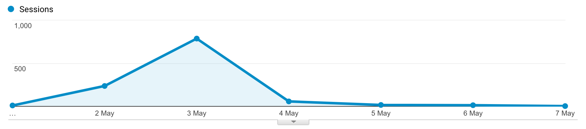
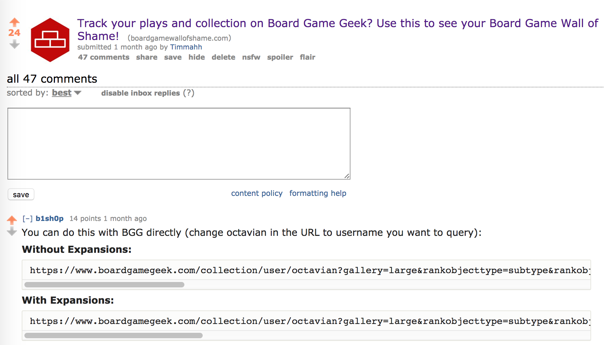

<meta property="og:image"
    content="http://timveletta.com/bgwos.png" />

Just over a month ago I released my small side-project to the world and while the limited hype around it has fizzled out, its an experience I will never forget. I built a web app that showed Board Game collectors to show the games in their collection that they have not played, something commonly known as a 'wall of shame'; you can view it at [Board Game Wall of Shame](www.boardgamewallofshame.com).

This was the first time I've ever built something to the point where I felt proud to put it out in the wild. Normally I would start a whole bunch of ideas but never get to a point where I can look at it and say I'm proud for people to start using it. I feel like I have partly experienced a fear of shipping and partly a lack of motivation to continue working on things.

  <figure>
    
    <figcaption>My approach to side projects</figcaption>
  </figure>

I must say I've read my fair share of articles about dealing with a fear of shipping but the most useful by far was a Hacker News thread on it in which, a wise person stated that the **only way to get over a fear of shipping is by actually shipping**. There are more pieces of wisdom in [the thread](https://news.ycombinator.com/item?id=13350238) which I could rehash however here are some of the biggest things I learned from this process.

# Know your Target Audience

And know where they frequently go; it helps if you are also part of this community. These are the people that are going to care about what you're doing and make sure you're not just telling people you know because you're not always going to get realistic feedback from them.

So for me this was easy, I was targeting board gamers and the places they most frequent are [/r/boardgames] and [Board Game Geek]. I got my biggest spike in users when I posted my project to the Board Games Subreddit which was an incredibly exciting experience for me. I was able to watch the usage graphs spike and the database fill up with entries which was really fucking cool.

  <figure>
    
    <figcaption>My first week of traffic</figcaption>
  </figure>

# Respond to Feedback

No matter how good or bad it is, make sure you have a presence and respond to what people have to say.

This was the hardest one for me, not everyone is going to like what you've done and those people are typically the ones that are going to let you know about it. Within the first 10 minutes of my post being on Reddit someone commented with a URL on Board Game Geek that will allow you to do the exact same thing as my web app did. At this point I could have said "how stupid am I for building something that is already easily available?!" and called it a night.

  <figure>
    
    <figcaption>Called out on Reddit</figcaption>
  </figure>

But I think the most important thing is how you respond to that feedback. I could take pride in how well my web app displayed the results and how people found it more pleasurable to use. So make sure whenever you release your product, you are there to respond to people and provide a real presence behind it no matter if the feedback is good or bad.

# Continuing Work is Harder than Finishing

One of the most amazing things that happened when I released my app and told people about it was the constructive feedback and additional features people wanted to see. While it was extremely exciting to see people using my product, it was more exciting that they could see the potential of it and give me ideas on how to improve it.

While getting the app to a point where I was proud to show it off was difficult and became a bit of a slog at times, it was a whole lot more difficult trying to continue on working on it. In my head I was done, I had got it to a point where I was happy with it and even though some people provided me with some great ideas to extend it, I just could not find the motivation to implement them.

I think this comes back to my approach to side projects where I always want to work on the next big idea because after enough time I poke enough holes in the existing ideas them that they sink. That is why something like the Board Game Wall of Shame is going to be something I may use from time to time but I think it will eventually fall away.

Having said that, the experience of actually shipping something and getting it in the hands of actual users was a hugely beneficial one, mostly full of ups and involving a sizeable learning curve in how to deal with feedback. It is something I would love to do again, provided I come up with something I am motivated to work on for long enough.
