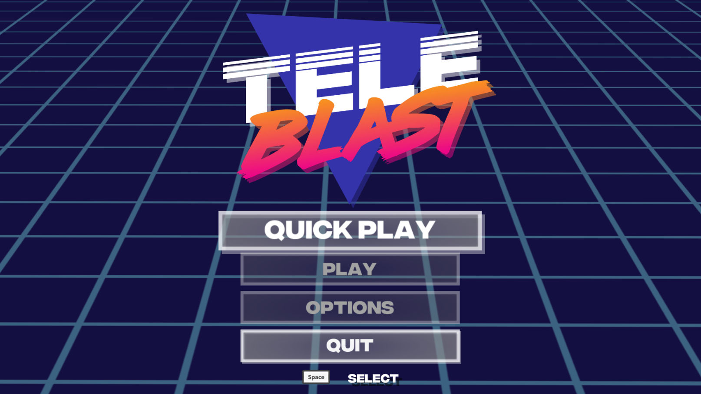

TL;DR - there is a whole bunch of changes that were introduced to make the game look and feel better.

    

Firstly, if you would like to support the ongoing development of TeleBlast please follow and wishlist the game on [**Steam**](https://store.steampowered.com/app/915420/TeleBlast/) and purchase the game on [**itch.io**](https://timmahh.itch.io/teleblast) to play it now for 50% off the release price and we will send you a Steam key when it is done.

This set of changes aims at changing the look and feel of the game to fit in better with the new logo and direction of the game. I am looking to achieve a more retro look and dial back the sports theme that has been present in the game. Here is a comprehensive look at the changes.

## User Interface

- Refactor the look of the following screens to mesh with the new logo and direction of the game:
  - Main menu
  - Player select
- To go back screens you have to hold down the back button to prevent players from unintentionally going back.

## Gameplay

- Teleporters get deflected by explosions based on how big the explosion is. This prevents players from teleporting into another players explosion and dying straight away.

## Graphics

- Fix the layering of elements on the screen so that players and effects are behind level details.
- Adding screen shake to explosions based on how big the explosion is to give more feeling to that action.

  

      <video width="100%" height="auto" controls>
          <source src="./screen shake.mp4" type="video/mp4">
      Your browser does not support the video tag.
      </video>
  

- Adding dash particles and sound FX to give more feeling to that action.

  

      <video width="100%" height="auto" controls>
          <source src="./dasheffect.mp4" type="video/mp4">
      Your browser does not support the video tag.
      </video>
  

- Adding dissolve effect when shields are hit.
- Slow motion for 0.5 seconds when a player gets killed to give feeling to that action.
- Replace all in game images with SVGs using the new Unity SVG import tool to make them look more crisp at all resolutions.

The new patch will focus on adding variations to the game to keep things interesting and change them from one game to the next. Things such as seeking teleporters and explosions that turn into a hail of bullets so looking forward to showing that in 2 weeks time!
