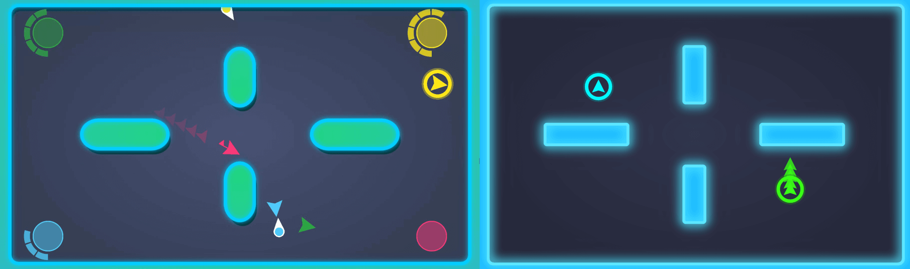

This update marks the first major update during Early Access and has been designed to make the game look and feel better to play. I've included a lot of feedback from the playtest events that we have been a part of and rewritten a lot of the logic behind the game.

## General

- **Added** new Music and sound FX by (Aaran) Insole Games (check out [@InsoleGames on Twitter](https://twitter.com/insolegames))

- **Modified** player colours. Here are the new colours with purple being added due to popular demand.

  

      
  

## Bugfixes

- **Fixed** issue that occurred whenever you died mid-explosion; it would make your explosion full size before imploding rather than just imploding from the size it was at the time of death.

- **Fixed** many issues around the scoreboard and scorekeeping. This should be more accurate and consistent now.

## Graphics

- **Added** teleporter trails - dressed this up a bit.

    

      <video width="100%" height="auto" controls>
          <source src="./trails.mp4" type="video/mp4">
      Your browser does not support the video tag.
      </video>
  

- **Modified** “Map Select” images to better reflect the maps themselves

- **Modified** map design and effects

  

      
  

  

      
  

## Gameplay

- **Added** the outer circle - previously a round could take a while to end when players were stuck on opposite sides of a map or just weren’t doing anything attacking. I’ve added a circle that slowly reduces the amount of available space for players which is enabled from 20 seconds into a round or when there are only 2 players remaining.

   

      <video width="100%" height="auto" controls>
          <source src="./outer-circle.mp4" type="video/mp4">
      Your browser does not support the video tag.
      </video>
  

- **Added** 3 more maps - this takes the total number of maps up to 5 and adds dynamic elements to some of the maps.

  

      
  

  

      
  

  

      
  

* **Removed** player shields persisting from round to round - this is to ensure that a player further ahead on the scoreboard won’t keep their shield from one round to the next and makes it easier for other players to catch up.

* **Added** maximum speed for teleporters - previously teleporters could move as fast as they wanted so when a teleporter hit an explosion, they would usually get an unfair speed boost.

## UI

- **Removed** “Quick Play” button from main menu - this button served as a way to quickly get into game but it was seldom used and wasn’t really clear with what it did.

- **Added** Nintendo Switch Joycon button icons - I’ve been testing the game using Switch Joycons so it made sense to add those button icons to the UI screens.

  

      
  

* **Modified** layout of Game Select screen - makes it clearer for the user what options they have.

  

      
  

- **Moved** “Modifiers” to its own screen rather than being embedded in the game select screen.

  

      
  

## What is next?

- **Adding** match intensity level which will be something that is detemined in the background and will affect the music, sound FX and graphical effects to increase the tension felt by players.
- **Adding** the "King of the Hill" game mode.
- **Adding** the option to play out a "practice round" to introduce new players to the game and allow them to get a feel for moving around before being competitive.

As always you can find out more about TeleBlast on our website (https://teleblastgame.com) and our community on [Discord](https://discord.gg/ZRwbxWw).
