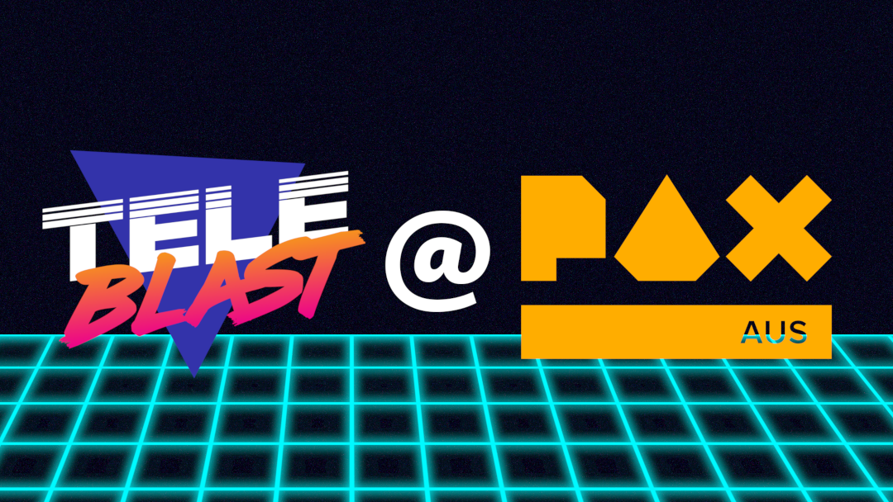

    

I am beyond excited to announce that TeleBlast has been invited to showcase as part of the indie booth at PAX Australia from October 26th-29th in Melbourne. For a game that started out development at Global Game Jam and became something I just wanted to finish to have at least 1 completed project; I would have never imagined that it would end up being showcased at an event as big as PAX.

From now until the event, I am looking to get the game as release ready as possible including an entirely new look and feel along with brand new game modes, variants and maps to play on. If you would like to follow the progress of the game check out the game on [**Twitter**](https://twitter.com/teleblastgame), [**Instagram**](https://instagram.com/teleblast) and [**Facebook**](https://facebook.com/teleblast).

And if you would like to support the ongoing development of TeleBlast please follow and wishlist the game on [**Steam**](https://store.steampowered.com/app/915420/TeleBlast/) and purchase the game on [**itch.io**](https://timmahh.itch.io/teleblast) to play it now for 50% off the release price and we will send you a Steam key when it is done.
