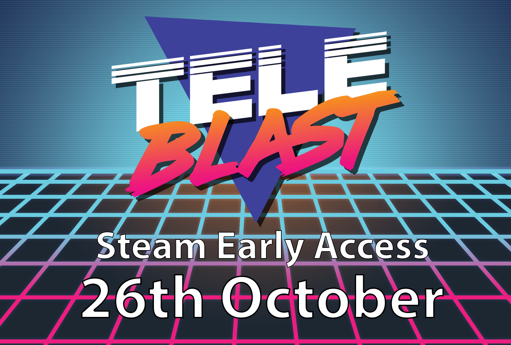

    

<iframe src="https://store.steampowered.com/widget/915420/" frameborder="0" width="646" height="190"></iframe>

It is finally happening, the game that started out at Global Game Jam 2018 will be hitting Steam Early Access on the 26th of October. We will be pressing the GO button live at PAX Australia so you will be able to play the game as part of the Indie Showcase and then go buy it to show your friends!

One of the reasons I am going down the route of Early Access is that I feel that TeleBlast currently doesn't have all the content that you would expect of similar games in the local multiplayer genre. The features I will be adding during the early access period include:

- **More maps** - the game will be released with 2-4 maps which I hope to expand to 10+ to allow for greater variations in play. I will also be adding interactive elements to some of the levels to really separate the good TeleBlast players from the great ones.
- **More game modes** - initially it will have just 2 game modes, regular TeleBlast and also Capture the Flag. I hope to add at least one more in King of the Hill.
- **More variants** - variants will change how the game is played, the game will ship with 9 different variations and there are another 5 planned. I also plan on adding save slots to allow players to save their favorite combinations.

If you would like to follow the progress of the game check out the game on [**Twitter**](https://twitter.com/teleblastgame), [**Instagram**](https://instagram.com/teleblast) and [**Facebook**](https://facebook.com/teleblast) and if you would like to support the ongoing development of TeleBlast please follow and wishlist the game on [**Steam**](https://store.steampowered.com/app/915420/TeleBlast/).
