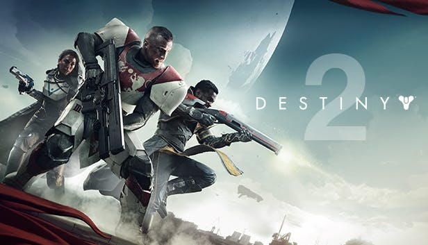

    <figure>
        
        <figcaption>Photo Credit - Humble Bundle and probably Bungie</figcaption>
    </figure>

> I have so many games in my Steam library and board game shelf and never enough time to play them all. I figured by writing short reviews it would enable me to think somewhat critically about the games rather than just saying its great and moving on. The typically enjoy the part of game reviews where they detail the good and the bad points about the game before providing a short verdict so that is what I've decided to do.

I acquired Destiny 2 through the June Humble Monthly Bundle ([check out my referral link here](https://www.humblebundle.com/monthly?refc=pUe5XN)) and managed to convince 2 of my closest friends to do the same so this past weekend we got together and played through the main storyline; this is the good and the bad.

## The Good

- **The story didn't overstay its welcome** - One of my major pet peeves with gaming is the focus on game length as a measure of value and I believe a game should be just long enough that you can finish it in a single weekend (with obvious exceptions). I really enjoyed the main storyline of Destiny 2 because it never felt like it was dragging on; it provided a gripping hook and finished before it became too incredulous or boring.
- **Player progression was quick and satisfying** - Something I was surprised with was how quickly you progress through leveling and building your characters abilities. We reached level 20 before finishing the main storyline and were quick to buy the expansions so we wouldn't be wasting any of that additional experience. It seems like the grind in Destiny 2 isn't getting to max level but in getting the best gear to complete the endgame content.
- **The visuals are amazing** - Just flying through some of the environments you can't help but be in awe of how beautiful some of the visuals are. My personal favorite was the planet of Nessus which is controlled by the cyborg-like race called the Vex.
- **Public events** - There is something so satisfying about rallying a group of strangers together to complete an event. Even though the events generally repeat themselves, it is still refreshing to participate in them and have a new group of people show up each time.

## The Bad

- **The pacing of some of the story missions was too slow** - Despite having such a beautiful environment there are a lot of areas you are just running through especially during story quests. I understand that sometimes it is used to build suspense or give the players a break between battles it just seemed like such a waste to have so many great environments where nothing really happens. I feel like there was more suspense built when entering a "Respawning Restricted" area.
- **Crucible maps don't feel like they flow** - This might be a slightly premature criticism but in the 2 Crucible (PVP) matches we played I was slightly disappointed with how poorly the maps flowed considering how well Bungie designed numerous Halo multiplayer maps. It is something I will have to explore further in the endgame.

## Verdict

A solid game made better in the presence of friends. If you can find it for around the same price of \$12, it is well worth your time.
