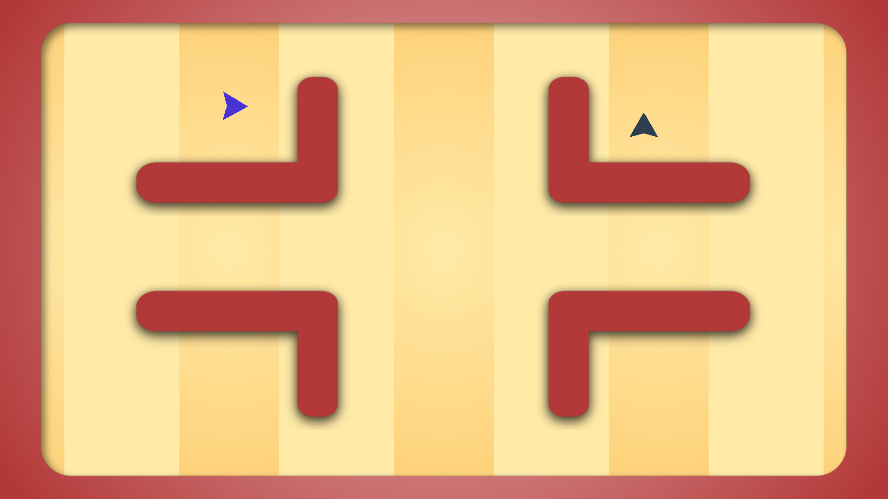
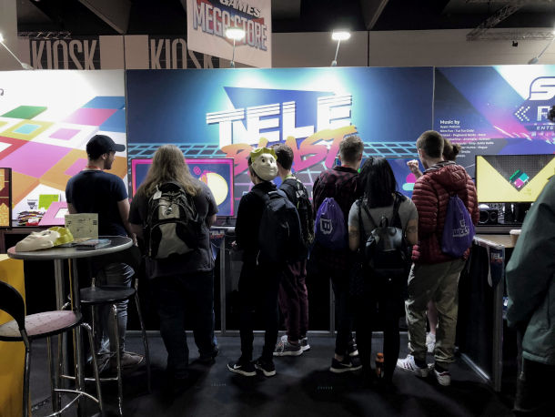

It started out development at Global Game Jam in 2018 where I had 48 hours to build a game around the themse of "transmission". It recieved great feedback at the post-jam showcase and subsequent playtest session with some close friends that prompted me to continue working on the game. The original version was called "Major League TeleBlast" due to its blend of sport and arcade genres but was subsequently shortened to "TeleBlast" closer to release.

I continued working on the game for a number of months and jumped at the opportunity to submit the game for the PAX Australia Indie Showcase which was the first time that anyone outside of my immediate friend group had played the game. To my surprise, it was one of the 6 games chosen for the showcase which turned out to be one of the most enjoyable experiences in my life.

TeleBlast was developed with C# and Unity and is slated for full release in July/August of 2019.
