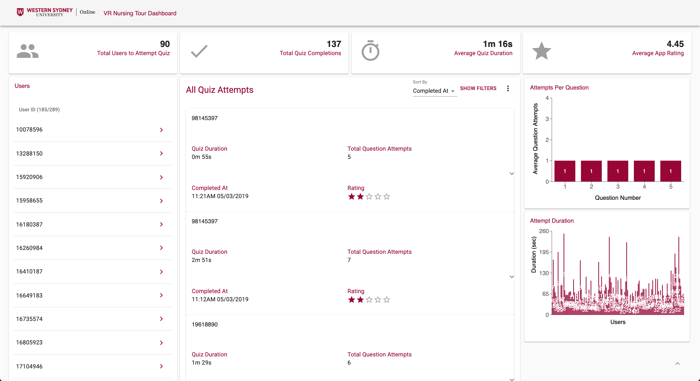

I was contracted by a local company by the name of [Virtual Guest 360](https://virtualguest360.com/), which specialise in creating VR and AR experiences, to create a dashboard which pulls data from a virtual reality nursing simulation. The idea was that the users walk through the simulation and answer some questions based on what was shown to them and formed part of the curriculum at the Western Sydney University nursing school. The below screenshot is an example of the dashboard that was produced.

My work was involved getting the data from the VR simulation built in **Unity** and sending it to **DynamoDB** where it was later accessed on the dashboard via some **Lambda** function calls. I also designed and implemented the dashboard in **React**, incorporating user feedback along the way and supported the product for a period after the contract ended.

This job taught me a lot about setting expectations when it comes to what I am working on, what I can produce and my time. I am extremely happy with what I produced and learned along the way.
